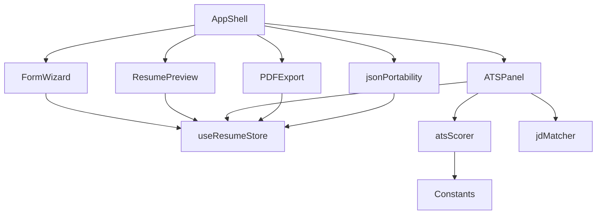

## 1. Stack
- React 18 + TypeScript, bundled with Vite 5 (package.json)
- Tailwind CSS v3 (`darkMode: 'class'` per README), PostCSS
- State: Zustand v4 + `persist` middleware → localStorage (package.json; README)
- UI primitives: Radix UI (select, slider, progress, tooltip, tabs, separator, label), Lucide icons (package.json)
- PDF: html2canvas + jsPDF (package.json; README)

## 2. Directory map

| path | what lives there |
|---|---|
| src/main.tsx | React root, mounts `<App/>` into `#root` |
| src/App.tsx | Root component, renders AppShell |
| src/index.css | Tailwind global styles |
| src/components/layout | AppShell, TopBar, AccentPicker |
| src/components/form | FormWizard, steps/ (6 step components), fields/ (TagInput, RichTextArea, DateRangePicker) |
| src/components/preview | ResumePreview, templates/ (4 template components) |
| src/components/ats | ATSPanel, JDMatcher, ScoreRing |
| src/components/shared | SectionHeader, AddItemButton, RemoveButton |
| src/store | useResumeStore.ts (Zustand + persist) |
| src/lib | atsScorer, jdMatcher, pdfExport, atsPdfExport, jsonPortability, utils |
| src/hooks | useATSScore, useJDMatch, usePDFExport |
| src/constants | actionVerbs, atsKeywords, templates, demoData |
| src/types | resume.ts (all TS interfaces) |
| src/assets | logo.png |

## 3. Diagram

## 4. Component index
- [[AppShell]]
- [[FormWizard]]
- [[ResumePreview]]
- [[ATSPanel]]
- [[useResumeStore]]
- [[atsScorer]]
- [[jdMatcher]]
- [[PDFExport]]
- [[jsonPortability]]
- [[Constants]]

## 5. Entry points
- **Dev**: `npm run dev` (vite) → serves `index.html` → `<script type="module" src="/src/main.tsx">` (index.html:17)
- **Prod build**: `npm run build` (`tsc && vite build`) → static output to `dist/` per README; `npm run preview` serves it (package.json)
- **Bootstrap**: `src/main.tsx` calls `createRoot(...).render(<App/>)` (src/main.tsx:6-10); `App` renders `<AppShell/>` (src/App.tsx:4)

## 6. Conventions
- Path alias `@/` used for imports from `src/` — e.g. `import { AppShell } from '@/components/layout/AppShell'` (src/App.tsx:1)
- Components grouped by feature domain under `src/components/{layout,form,preview,ats,shared}` (README project structure)
- Pure logic isolated in `src/lib/*` (functions), wrapped by `src/hooks/*` (React hooks), consumed by components — e.g. `atsScorer.ts` described as "Pure scoring function" (README:95)
- All TypeScript interfaces centralized in `src/types/resume.ts` (README:92, 177)
- Global state in a single Zustand store with `persist`, localStorage key `ai-resume-builder-v1` (README:76, 190)
- No backend — all logic runs client-side (README:81)
- Error handling: TODO: verify (not observed in files read)

## 7. Where things go
- **New resume section** (e.g. Publications): `src/types/resume.ts` (interface) + `src/store/useResumeStore.ts` (state/actions) + `src/components/form/steps/` (new wizard step) + `src/components/preview/templates/` (render in each template)
- **New template**: `src/components/preview/templates/` (component) + `src/constants/templates.ts` (metadata) + `src/components/layout/TopBar.tsx` (selector)
- **New ATS scoring category**: `src/lib/atsScorer.ts` (logic) + `src/constants/` (keyword/verb bank) + `src/components/ats/ATSPanel.tsx` (display)
- **New role keyword bank**: `src/constants/atsKeywords.ts`
- **Change PDF export behavior**: `src/lib/pdfExport.ts` (visual templates) or `src/lib/atsPdfExport.ts` (ATS template) + `src/hooks/usePDFExport.ts`
